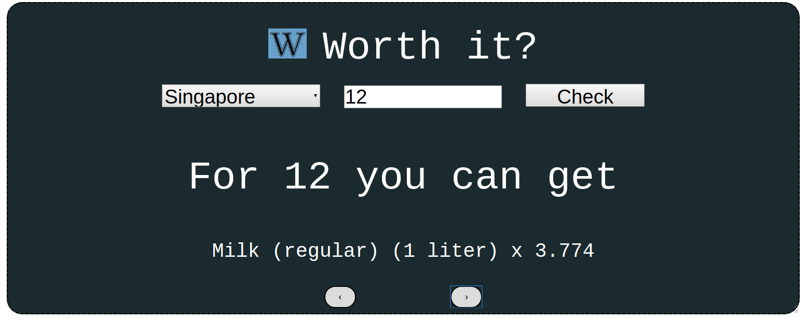

<h1 align="center">Worth it?</h1>

Ever travelled to a different country, and wondered if FC 10 (FC - Foreign Currency) was worth a candy bar, a laptop or a house? `Worth it` gives you an idea of the cost of living in the country by telling you what you could buy with a given amount of money. 

For example, if you were new to Singapore and saw a toffee was priced at S$12, `Worth it?` would tell you what else you could get with your 12 bucks, so you have an idea if its worth after all!

***

